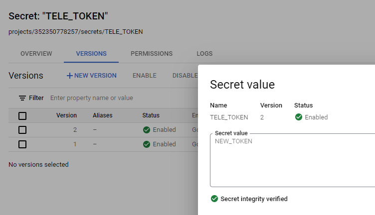
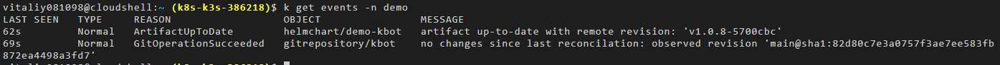
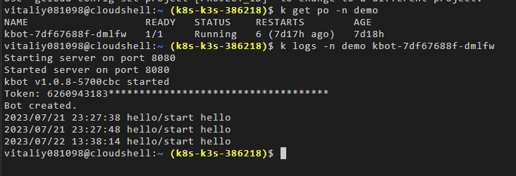
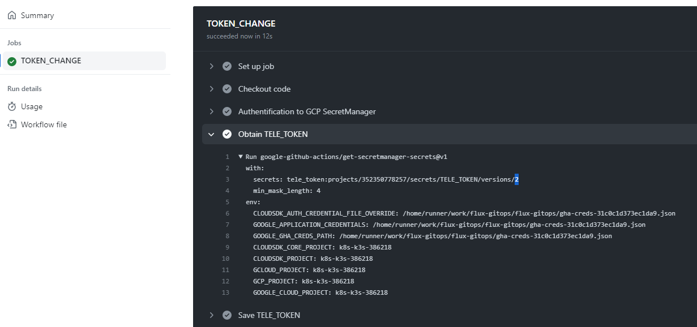
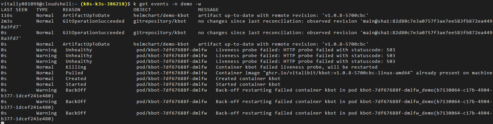
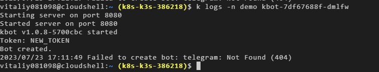
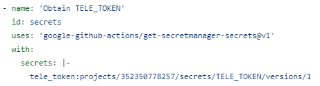
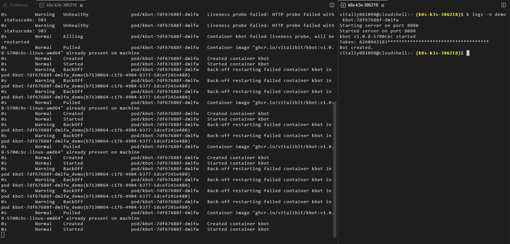

# flux-gitops
## How it works
Flux provides reconsilation of our deployment. Inside its repository, there is a pipeline whose goal is to take the Telegram API token TELE_TOKEN and, in conjunction with sops+kms, encrypt it into a .yaml file and push it to the flux repo. From this repo, flux extracts this .yaml file and applies it to our deployed kbot deployment. For automatical rotation of secrets in the kbot application, an additional server is created to which the liveness probe is accessed via the /liveness path. liveness probe receives a response after checking with the kbot server to see if the secret that was in the volume mount has changed. If the secret has been changed, liveness probe receives a 503 status and restarts the pod with a new TELE_TOKEN. For demonstration purposes, we will show the use of an invalid version (2) of the TELE_TOKEN token with the value "NEW_TOKEN". This, in turn, will cause an error in the kbot, but after that the pipeline will be launched to retrieve the valid version (1) and the kbot will work as expected.

## Link to kbot application

1. GCP Secret Manager

2. Show that kbot is working well with valid token

3. Start pipeline with invalid version 2 TELE_TOKEN

4. Liveness probe fails due to change of value of TELE_TOKEN. It restarts our pod

5. Logs of restarted pod with invalid secret

6. Restart pipeline with valid TELE_TOKEN version to provide correct work of kbot application

